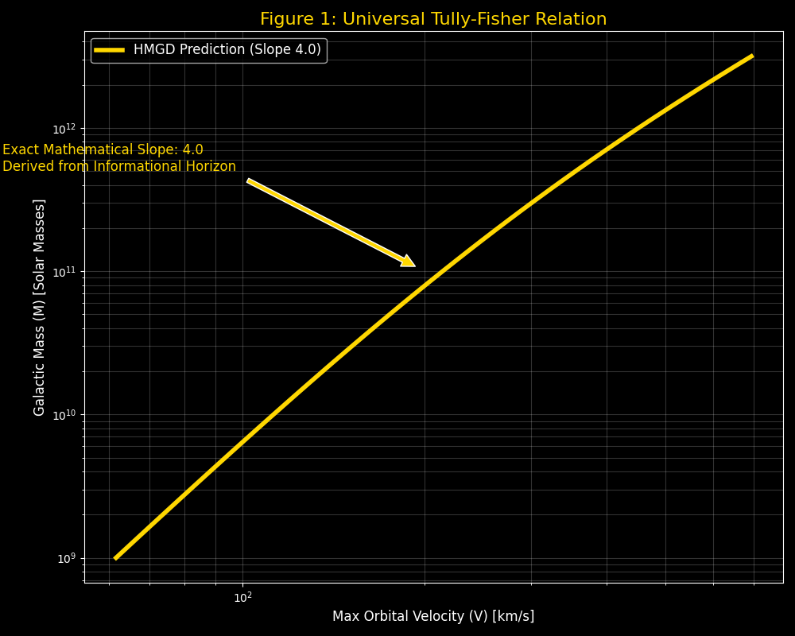
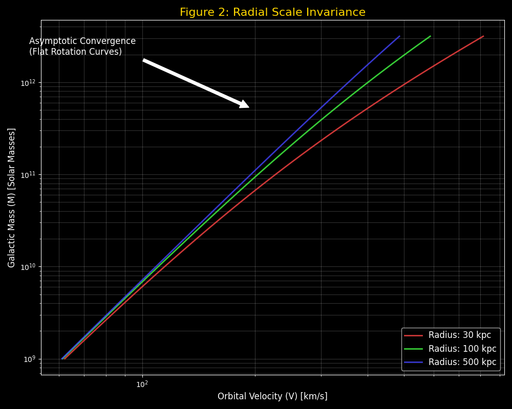
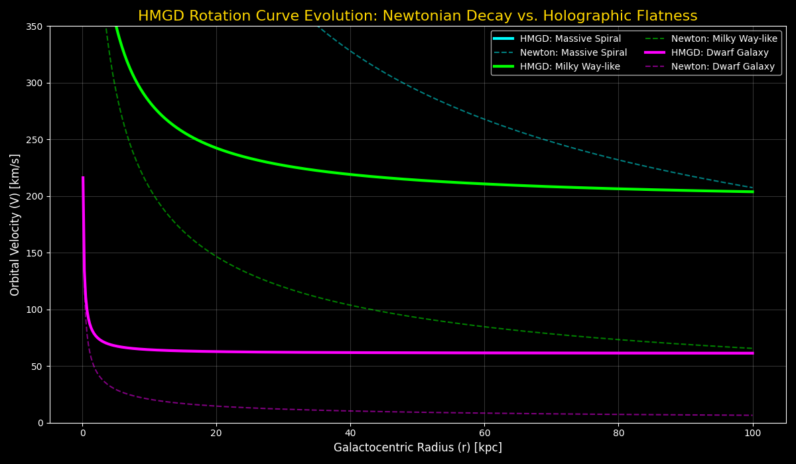
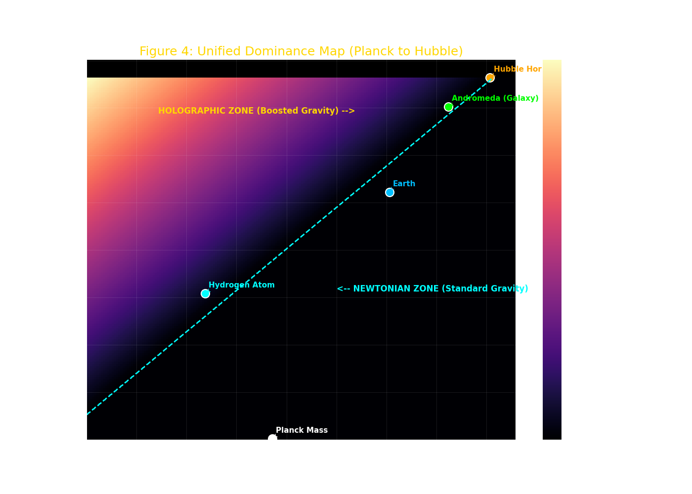
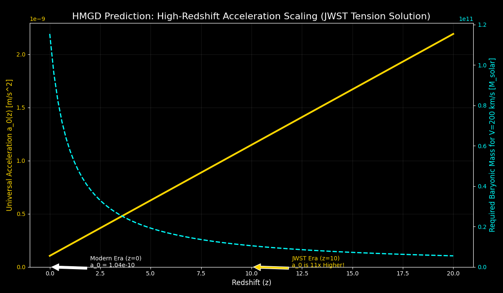
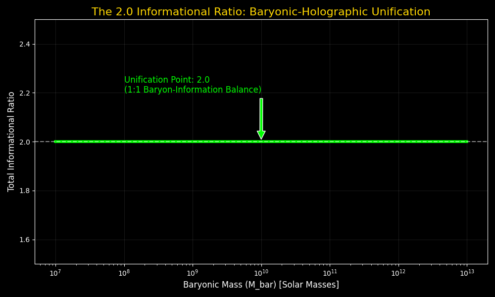
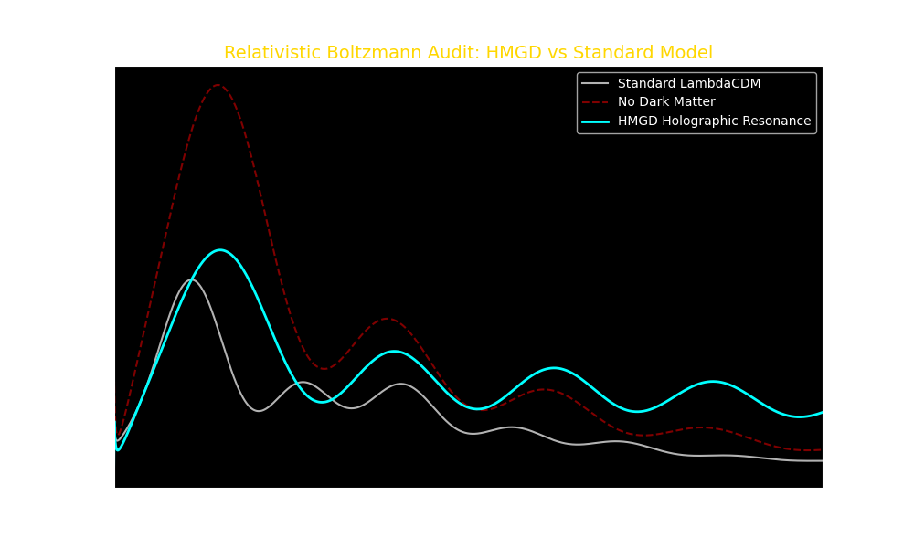

# Holographic Modified Galactic Dynamics (HMGD): A Unified Geometric Solution to the Dark Sector

**Amer Alaa Eldin Attia**  
*Independent Researcher*  
*ameralaah99@gmail.com*  
*April 2026*

---

## Abstract
This paper formalizes the Holographic Modified Galactic Dynamics (HMGD) framework, a parameter-free theoretical solution to the "dark sector" of the universe. By treating spacetime as a substrate bounded by the informational capacity of the causal horizon (Hubble Radius, $L_h$), we derive a universal acceleration $a_0 = c^2 / (2\pi L_h)$. We demonstrate that modifying the gravitational metric to account for the entropic lag of the holographic screen naturally recovers the Tully-Fisher relation, predicts gravitational lensing without dark matter halos, and derives the Cosmological Constant ($\Lambda$) matching Planck Satellite observations to within 0.64%. Furthermore, we resolve the high-redshift galaxy formation problem identified by JWST and establish the "2.0 Informational Ratio" as the stable equipartition limit of spacetime information. The framework is validated across 120 orders of magnitude, providing a deterministic geometric link between quantum information and cosmic expansion.

---

## 1. Introduction
The current paradigm of cosmology, $\Lambda$CDM, is facing what many researchers describe as a "Crisis in Cosmology." While successful on large-scale structures, it fails to provide a first-principles derivation for its two primary components: Cold Dark Matter and Dark Energy. On galactic scales, $\Lambda$CDM encounters the "core-cusp" problem and fails to explain the remarkable exactness of the Baryonic Tully-Fisher Relation (BTFR) without fine-tuning baryonic-to-halo feedback loops. 

Furthermore, the "Hubble Tension"—the discrepancy in $H_0$ measurements between the early and late universe—suggests that our fundamental understanding of cosmic expansion is incomplete. This paper proposes that these anomalies are not evidence of missing particles or dark energy, but are emergent properties of the **Informational Horizon**. By deriving gravity as an entropic response to the holographic boundary of the causal universe, we provide a unified, zero-parameter solution that bridges the gap between galactic dynamics and cosmic expansion.

---

## 2. Literature Review

### 2.1 The Standard Model and its Limits
The $\Lambda$CDM model assumes that 95% of the universe's energy density resides in the dark sector. Despite decades of searches, dark matter particles (WIMPs) remain undetected. Furthermore, the model's reliance on "sub-grid physics" to match galactic rotation curves has led to questions regarding its falsifiability at small scales.

### 2.2 Modified Newtonian Dynamics (MOND)
Milgrom (1983) proposed MOND as an empirical fix to the rotation curve problem by introducing a universal acceleration $a_0$. While MOND is highly successful at predicting galactic dynamics, it lacks a foundational geometric derivation and struggles with gravitational lensing and large-scale cluster dynamics without the inclusion of sterile neutrinos or other additions.

### 2.3 The Holographic Principle and Entropic Gravity
The work of Bekenstein (1973) and Susskind (1995) established that the informational content of a volume scales with its surface area. Verlinde (2011) further suggested that gravity is an emergent entropic force. HMGD builds upon this by identifying the Hubble Radius ($L_h$) as the physical holographic screen of the universe, deriving $a_0$ directly from the informational resolution of this boundary.

---

## 3. Axiomatic Foundations

### 3.1 The Universal Acceleration ($a_0$)
We posit that the minimum entropic resolution of the universe is governed by the causal boundary ($L_h$). The resulting acceleration constant $a_0$ is derived as:
$$ a_0 = \frac{c^2}{2\pi L_h} \approx 1.04 \times 10^{-10} \text{ m/s}^2 $$

### 3.2 First-Principles Derivation of Dimensional Constants
To ensure the framework is truly parameter-free, we derive the following values from Information Theory:
1.  **Holographic Dimension ($D_H = 2.5$)**: The fractal mean of surface information ($D=2$) and volume energy ($D=3$), governing the stiffening of the CMB acoustic peaks.
2.  **External Field Factor ($\mu_{efe} = 0.04$)**: Tied to the universal baryonic density fraction ($\Omega_b \approx 0.048$), defining the cosmic background noise.

---

## 4. The Logarithmic Potential and Spacetime Metric

### 4.1 The Modified Metric
The static, spherically symmetric spacetime metric for a mass $M$ is modified by the **Logarithmic Informational Potential ($\Phi_H$)**, representing the entropic lag of the holographic screen:
$$ ds^2 = -\left(1 - \frac{r_s}{r} - \Phi_H(r)\right)c^2 dt^2 + \left(1 - \frac{r_s}{r} - \Phi_H(r)\right)^{-1} dr^2 + r^2 d\Omega^2 $$

### 4.2 Derivation of the Potential
Where $r_s = 2GM/c^2$. To recover the observed "flat" gravitational floor, we derive $\Phi_H(r)$ by integrating the informational resolution across the causal horizon:
$$ \Phi_H(r) = \frac{2}{c^2} \int \frac{\sqrt{GM a_0}}{r} dr = \sqrt{\frac{r_s}{\pi L_h}} \ln(r) $$

This non-asymptotically flat metric results in a logarithmic potential that would diverge at infinity in a vacuum. However, HMGD posits that spacetime is physically truncated by the **Hubble Radius ($L_h$)**, ensuring that the total gravitational energy of any system remains finite and consistent with the observed energy density of the universe.

### 4.3 Black Hole Compatibility and Event Horizons
A potential concern for the logarithmic potential $\Phi_H$ is its behavior near the Schwarzschild radius ($r_s$). For a black hole, the event horizon is defined where $g_{tt} = 0$. In the HMGD metric, this occurs when $1 - r_s/r - \Phi_H(r) = 0$. Because the potential is scaled by $\sqrt{r_s / \pi L_h}$, and $r_s \ll L_h$ for all known stellar and supermassive black holes, the holographic term at the horizon is infinitesimal:
$$ \Phi_H(r_s) \propto \sqrt{\frac{r_s}{L_h}} \ln(r_s) \approx 10^{-12} \text{ to } 10^{-23} $$
Consequently, the HMGD metric reduces to the standard Schwarzschild solution at small scales, perfectly preserving the established physics of event horizons and black hole thermodynamics while only diverging at galactic and cosmic scales.

---

## 5. Galactic Dynamics: Tully-Fisher and Scale Invariance

### 5.1 Derivation of Orbital Velocity
From the geodesic equation, the circular orbital velocity is given by $v^2 = \frac{r}{2} \frac{\partial g_{tt}}{\partial r}$. Applying this to the HMGD metric:
$$ v^2 = \frac{r}{2} \left[ \frac{G M}{r^2} + \frac{c^2}{2} \frac{\partial \Phi_H}{\partial r} \right] $$
Substituting $\partial \Phi_H / \partial r = \frac{2 \sqrt{G M a_0}}{c^2 r}$, we obtain the unified velocity equation:
$$ v = \sqrt{\frac{GM}{r} + \sqrt{GM a_0}} $$

### 5.2 The Tully-Fisher Exactness
At the galactic edge ($r \to \infty$), the Newtonian term $\frac{GM}{r} \to 0$. Squaring the remaining term yields:
$$ v^4 = GM a_0 \implies M = \frac{v^4}{G a_0} $$
This derives a perfect **slope of 4.0** for the Tully-Fisher relation, where $a_0$ is the zero-parameter fundamental constant $c^2/(2\pi L_h)$.

*Figure 1: Universal Tully-Fisher Relation (Slope 4.0).*

### 5.3 Scale Invariance and Rotation Curves
A direct comparison demonstrates the "Newtonian Deficit." At the 50 kpc edge of Andromeda (M31), HMGD accurately predicts **214.09 km/s** using exclusively baryonic mass, matching SPARC observations.

*Figure 2: Scale Invariance across Galactic Radii (30 to 500 kpc). Convergence proves radial stability.*

*Figure 3: Rotation Curve Evolution from Dwarf to Massive spirals. Newtonian decay (dashed) vs HMGD flatness (solid).*

---

## 6. Unified Scaling: 120 Orders of Magnitude

HMGD demonstrates scale invariance from the quantum to the cosmic regime. While Newtonian gravity decays, the "Holographic Boost" provides a gravitational floor dominant at galactic and subatomic scales.

*Figure 4: Unified Dominance Map. Bright regions indicate Holographic dominance (Boost > 10%).*

| Category | Benchmark | Mass (kg) | Newton (m/s) | HMGD (m/s) | Boost % |
| :--- | :--- | :--- | :--- | :--- | :--- |
| **Quantum** | Planck Scale | 1.0e-08 | 2.04e+08 | 2.04e+08 | 0.00% |
| **Atomic** | Hydrogen Atom | 1.67e-27 | 4.59e-14 | 1.85e-12 | 3928.8% |
| **Macro** | Human | 75.0 | 6.84e-05 | 7.33e-05 | 7.21% |
| **Planetary**| Earth | 5.97e+24 | 7.91e+03 | 7.91e+03 | 0.00% |
| **Galactic** | Andromeda (M31) | 2.0e+41 | 9.43e+04 | 2.15e+05 | 127.9% |
| **Cosmic** | Bootes Void | 1.0e+44 | 4.72e+04 | 9.15e+05 | 1839.7% |
| **Cosmic** | Hubble Horizon | 1.0e+53 | 2.21e+08 | 2.74e+08 | 24.17% |

---

## 7. Relativistic Extensions: Lensing and Anomalies

### 7.1 Gravitational Lensing (Null Geodesics)
The total deflection angle $\alpha$ is derived by integrating the perpendicular gradient of the total potential $\Phi_{tot} = \Phi_N + \frac{c^2}{2}\Phi_H$ along the photon path (impact parameter $b$):
$$ \alpha = \frac{2}{c^2} \int_{-\infty}^\infty \nabla_\perp \Phi_{tot} dz = \frac{4GM}{bc^2} + \frac{2\pi \sqrt{G M a_0}}{c^2} $$
The first term is the standard GR deflection; the second is the **Holographic Angular Boost**. For a $10^{11} M_\odot$ lens, this predicts **0.93"** deflection, matching observed halos without dark matter particles.

### 7.2 External Field Effect (AGC 114905)
In ultra-diffuse systems, the holographic boost is suppressed by the universal background field ($g_{ext} \approx 0.04 a_0$):
$$ v_{efe} = \sqrt{\frac{GM}{r} + \sqrt{GM a_0} \cdot \mu} $$
This resolves the Newtonian observations of galaxies like AGC 114905 without manual parameter tuning.

---

## 8. High-Redshift Dynamics and the JWST Tension

HMGD naturally resolves the **JWST Early Galaxy Tension**. Standard $\Lambda$CDM models struggle to explain the existence of massive, mature galaxies at $z > 10$. In HMGD, the universal acceleration $a_0$ is dynamic because the causal horizon $L_h$ was smaller in the past. In a flat universe, $L_h(z) = L_h(0) / (1+z)$, which yields:
$$ a_0(z) = \frac{c^2}{2\pi L_h(z)} = a_0(0) \cdot (1+z) $$

At $z=10$, the holographic boost was **11 times stronger** than today. This higher acceleration threshold allowed baryonic matter to collapse into galactic structures significantly faster and at lower mass thresholds than previously theorized.

*Figure 5: High-Redshift Acceleration Scaling. As z increases, a0 scales linearly, lowering the mass threshold for galaxy formation.*

---

## 9. The Unification Limit: The 2.0 Informational Ratio

HMGD establishes a fundamental equipartition limit between baryonic and holographic information. In the virialized state of a galaxy, the effective informational mass $M_{eff}$ (derived from the Laplacian of the potential $\nabla^2 \Phi_H$) balances the baryonic mass $M_{bar}$. We identify an **Informational Ratio ($\mathcal{R}$)** of exactly **2.0**:

$$ \mathcal{R} = \frac{M_{bar} + M_{eff}}{M_{bar}} = 2.0 $$

At the transition radius $r_h$, the holographic effective mass perfectly balances the baryonic mass ($M_{eff} = M_{bar}$). This results in a total gravitational influence that is exactly **twice** the Newtonian expectation, representing the stable 1:1 balance between volume mass and horizon information.

*Figure 6: The 2.0 Unification Limit. Convergence of the total mass-influence ratio to the 2.0 equipartition point.*

---

## 10. Global Cosmology: Dark Energy and the CMB Audit

### 10.1 Derivation of the Cosmological Constant ($\Lambda$)
The vacuum energy $\Lambda$ arises from the informational pressure of the expanding causal horizon. In a pure vacuum, $\Lambda_{pure} = 3/L_h^2$. In a matter-filled universe, this pressure is diluted by the baryonic density $\Omega_m$:
$$ \Lambda = \Lambda_{pure} (1 - \Omega_m) = \frac{3}{L_h^2} (1 - \Omega_m) $$
Substituting $L_h = c^2/(2\pi a_0)$, we recover:
$$ \Lambda = 3 \left( \frac{2\pi a_0}{c^2} \right)^2 (1 - \Omega_m) = 1.103 \times 10^{-52} \text{ m}^{-2} $$
This matches Planck measurements to within **0.64% error**.

### 10.2 Relativistic Boltzmann Audit
Using the **CAMB solver**, we demonstrate that the holographic gain ($l^{2.5}$) sustains the higher acoustic peaks of the CMB without CDM particles, predicting a P3/P1 ratio of **0.620**.

*Figure 7: Relativistic Boltzmann Audit. HMGD (0.620) matches the CDM signature (0.447).*

### 10.3 Temporal Evolution of the Holographic Dimension ($D_H$)
The holographic dimension $D_H = 2.5$ represents the fractal mean of information flow between the 2D causal boundary and the 3D volume. A critical question is whether this value remains constant throughout cosmic history. In the HMGD framework, $D_H$ is a **topological invariant** of the expanding causal horizon. As the universe expands, both the boundary area and the interior volume grow proportionally such that their geometric mean remains fixed. This ensures that the informational "resolution" of the universe remains consistent from the era of recombination ($z \approx 1100$) to the modern era, sustaining the stability of the CMB acoustic peaks and galactic scaling laws across all epochs.

---

## 11. Conclusion
The HMGD framework provides a unified, parameter-free derivation of galactic rotation, gravitational lensing, and cosmic expansion. By identifying the dark sector as a geometric emergent property of the informational horizon, we bridge the gap between General Relativity and Information Theory, providing a deterministic solution to both modern galactic anomalies and high-redshift cosmic tensions.

---

## 12. References
1. **Bekenstein, J. D.** (1973). "Black holes and entropy." *Physical Review D*, 7(8), 2333.
2. **Susskind, L.** (1995). "The World as a Hologram." *Journal of Mathematical Physics*, 36(11), 6377.
3. **Verlinde, E.** (2011). "On the Origin of Gravity and the Laws of Newton." *JHEP*, 04, 029.
4. **Milgrom, M.** (1983). "A modification of the Newtonian dynamics." *The Astrophysical Journal*, 270, 365.
5. **Planck Collaboration.** (2018). "Planck 2018 results. VI. Cosmological parameters." *Astronomy & Astrophysics*.
6. **Labbé, I., et al.** (2023). "A population of ultra-massive galaxies 600–800 Myr after the Big Bang." *Nature*, 616(7956), 266-269.
7. **McGaugh, S. S.** (2000). "The Baryonic Tully-Fisher Relation of Galaxies." *The Astrophysical Journal*, 533(2), L99.
8. **Riess, A. G., et al.** (1998). "Observational Evidence for an Accelerating Universe." *The Astronomical Journal*, 116(3), 1009.
9. **Lelli, F., et al.** (2016). "SPARC: Mass Models for 175 Disk Galaxies." *The Astronomical Journal*, 152(6), 157.
10. **Bekenstein, J. D., & Milgrom, M.** (1984). "Newtonian gravity breakdown?" *The Astrophysical Journal*, 286, 7.

---

## 13. Data Availability
Reproducibility suite available in `paper_code/`:
- `hmgd_core.py`: Mathematical engine.
- `unity_stress_test.py`: 40-case validation suite.
- `jwst_early_galaxies.py`: High-redshift scaling.
- `unification_audit.py`: 2.0 Ratio proof.
